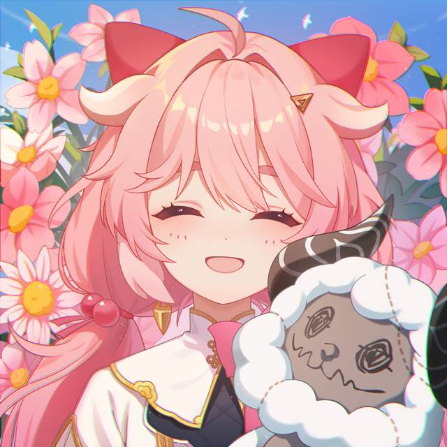
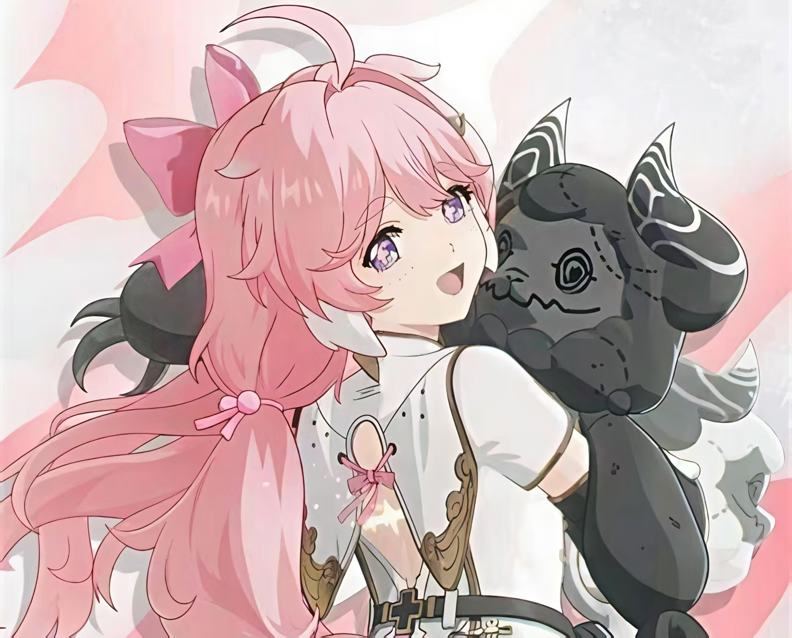

  

<h3 align="center">Want to be an 🎈acmer🎈, but not just algorithm</h3>
<h3 align="center">Want to be a 🌱developer🌱, but not just game</h3>

## 🛠️ Languages and Toolschlun

  
  
  
  
  
  

  <!-- Visitor Count -->
  

  

<!--
**1amluolikong/1amluolikong** is a ✨ _special_ ✨ repository because its `README.md` (this file) appears on your GitHub profile.

Here are some ideas to get you started:

- 🔭 I’m currently working on ...
- 🌱 I’m currently learning ...
- 👯 I’m looking to collaborate on ...
- 🤔 I’m looking for help with ...
- 💬 Ask me about ...
- 📫 How to reach me: ...
- 😄 Pronouns: ...
- ⚡ Fun fact: ...
-->
